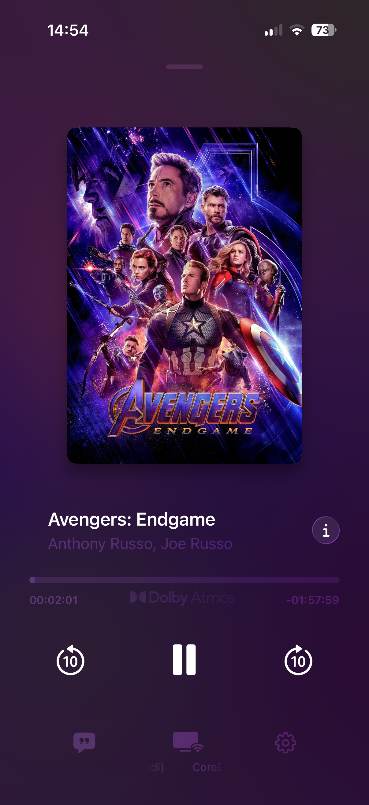
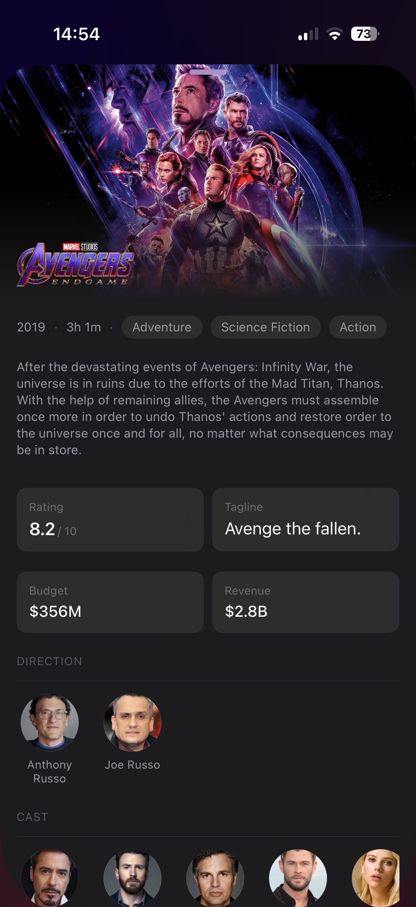
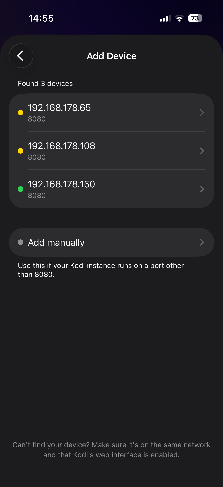
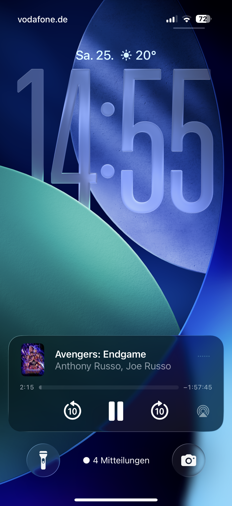
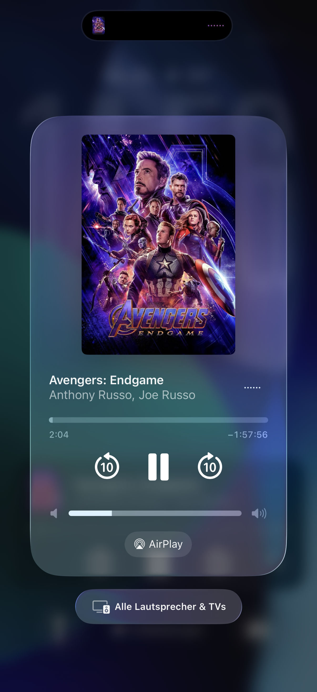

# Kodi Widget

A native iOS remote control for [Kodi](https://kodi.tv) — built to look and feel like Apple Music's fullscreen player. Browse what's playing, seek, switch subtitles and audio tracks, and control playback from your iPhone's Lock Screen without ever opening the app.

---

## Screenshots

<table>
  <tr>
    <td align="center">
      <br/>
      <sub><b>Fullscreen Player</b></sub>
    </td>
    <td align="center">
      <br/>
      <sub><b>Movie Info Sheet</b></sub>
    </td>
    <td align="center">
      <br/>
      <sub><b>Device Discovery</b></sub>
    </td>
  </tr>
  <tr>
    <td align="center">
      <br/>
      <sub><b>Lock Screen Widget</b></sub>
    </td>
    <td align="center">
      <br/>
      <sub><b>Control Center</b></sub>
    </td>
    <td></td>
  </tr>
</table>

---

## What it does

Kodi is powerful, but its iOS remotes are either clunky web apps or stripped-down utilities. Kodi Widget bridges the gap: it connects to your Kodi instance over Wi-Fi, polls playback state every second, and presents everything in a fullscreen player that feels at home on iOS 17+.

The app is purely a **remote** — it doesn't stream video, it just talks to Kodi's JSON-RPC API. Your Kodi box keeps doing the heavy lifting; your iPhone becomes the world's most cinematic remote control.

---

## Features

### Player UI
- **Fullscreen Apple Music–style layout** — large artwork, elastic timing slider, centred playback controls
- **Animated gradient background** — dominant colours are extracted from the current artwork using a custom GPU shader (`FPGradient.metal`) and interpolated through an inverse-distance-weighted GLSL gradient. The gradient slowly drifts and recolours itself as tracks change
- **Elastic timing slider** — drag to scrub; the track stretches and rebounds on over-drag. Labels sync style with the track. Releases seek Kodi to the exact position
- **Marquee scrolling titles** — long titles scroll automatically with configurable fade, spacing, and start delay
- **Artwork scale animation** — artwork is larger when paused, compresses when playing, with a matching drop shadow

### Playback Controls
- **Play / Pause** with a smooth symbol crossfade
- **Skip backward / forward 10 seconds** with a spring icon animation
- **Scrub to any position** via the timing slider — sends an absolute seek to Kodi
- **All controls disable gracefully** when nothing is playing, with an animated opacity fade

### Subtitle & Audio Track Management
- **Tap the subtitle button** to toggle subtitles on/off
- **Long-press the subtitle button** to open a track picker with flag emojis and native language names
- **Audio track picker** accessible from the Lock Screen's Now Playing language options
- **Dolby Atmos** and **DTS:X** badges appear automatically when the active audio stream codec matches

### Lock Screen & Control Center
- Full **iOS Now Playing integration** — title, artist (director), studio, album artwork, and a scrubber appear on the Lock Screen and in Control Center
- **Remote commands** — play, pause, skip ±10 s, and switch subtitle/audio tracks all work from the Lock Screen without opening the app
- A **near-silent looping audio session** keeps remote commands active while Kodi is playing (the system requires an active audio session)

### Movie Info Sheet
Pull up a bottom sheet with rich metadata fetched from [TMDB](https://developer.themoviedb.org):
- Fanart header with clear logo overlay
- Release year, runtime, genre pills
- Overview / synopsis
- Rating, tagline, budget, and revenue cards
- Scrollable **cast row** with profile photos
- **Director row** with profile photos
- **Production company** logos and names
- Tap the movie title to open it on **Letterboxd** (IMDb and TMDB IDs supported)

### Device Management
- **Auto-discovery** — the app scans your local subnet (port 8080) in parallel, verifies each host with a JSON-RPC ping, and lists found Kodi instances in seconds
- **Manual entry** — add a device by hostname/IP and any port if auto-discovery misses it
- **Edit and delete** saved devices with swipe actions
- **Multi-device** support — switch between devices from the footer menu

### Networking & Reliability
- **Wi-Fi monitor** — a dedicated overlay appears immediately when the device leaves Wi-Fi, preventing confusing errors
- **Debug mode** — populates the UI with hard-coded data so you can develop and test layouts without a running Kodi instance (enable via Settings → Debug)
- All network failures are logged with `OSLog` and swallowed gracefully — the UI never crashes on a missed poll

---

## Requirements

| | Minimum |
|---|---|
| iOS | 17.0 |
| Xcode | 16.0 |
| Swift | 5.9 |
| Kodi | 19 "Matrix" or later |

Kodi's **web interface** must be enabled:  
`Settings → Services → Control → Allow remote control via HTTP`

---

## Getting Started

### 1. Clone the repository

```bash
git clone https://github.com/your-username/kodi-widget.git
cd kodi-widget
```

### 2. Add your TMDB API key

The movie info sheet fetches metadata from [The Movie Database](https://developer.themoviedb.org/docs/getting-started). You need a free API key.

Copy the example credentials file and fill in your key:

```bash
cp "Kodi Widget/Resources/credentials.plist.example" \
   "Kodi Widget/Resources/credentials.plist"
```

Then open `credentials.plist` and replace the placeholder:

```xml
<key>tmdbApiKey</key>
<string>YOUR_KEY_HERE</string>
```

`credentials.plist` is git-ignored and will never be committed.

### 3. Open in Xcode

```bash
open "Kodi Widget.xcodeproj"
```

Swift Package Manager will automatically resolve the only dependency — **Kingfisher** — on first open.

### 4. Select a target and run

Choose your device or simulator from the scheme selector and hit **⌘R**.  
On first launch the app will ask you to add a Kodi device. Use **Add Device** to auto-discover or enter an IP manually.

---

## Project Structure

```
Kodi Widget/
├── ContentView.swift              # Root view; polling loop, environment injection
├── FullscreenPlayerView.swift     # The entire player UI (background, artwork, controls, footer)
├── SettingsView.swift             # Settings, device picker, add/edit device flows
├── NowPlayingSession.swift        # Lock Screen metadata + remote command wiring
├── WindowManager.swift            # Secondary window for the no-Wi-Fi overlay
│
├── Kodi/
│   ├── Models/
│   │   ├── AppModels.swift        # NowPlayingState (@Observable), AppSettings, Device
│   │   ├── DataModels.swift       # SwiftData models
│   │   ├── JsonRPCModels.swift    # Kodi JSON-RPC response types (camelCase + CodingKeys)
│   │   └── TMDBModels.swift       # TMDB API response types
│   ├── Services/
│   │   ├── KodiService.swift      # All JSON-RPC calls; unified metadata fetch strategy
│   │   ├── NetworkScannerService.swift  # Subnet scanner + JSON-RPC probe
│   │   └── NetworkMonitorService.swift  # NWPathMonitor Wi-Fi observer
│   └── Extensions/
│       ├── ColorExtension.swift
│       └── StringExtension.swift
│
├── FPGradient.metal               # GPU shader for the animated multicolor background
└── Resources/
    ├── silent.mp3                 # Near-silent audio for keeping remote commands alive
    ├── credentials.plist          # Your TMDB API key (git-ignored)
    └── credentials.plist.example  # Safe template committed to source control
```

---

## Architecture

The app follows a straightforward unidirectional data flow:

```
ContentView (polling loop)
    │
    ├── KodiService  ──────────────── Kodi JSON-RPC API
    │       └── fetches every 1 s
    │
    └── NowPlayingState (@Observable, @MainActor)
            │
            └── injected via .environment(state)
                    │
                    ├── FullscreenPlayerView
                    ├── PlayerBackground
                    ├── PlayerArtwork
                    ├── PlayerControls
                    │       ├── TrackInfoRow
                    │       ├── TimingSlider
                    │       ├── PlaybackButtonsView
                    │       └── PlayerFooter
                    └── GlassInfoButton → MovieInfoSheet
```

`NowPlayingState` is the single source of truth. Every view reads from it via `@Environment` — no parameter drilling, no duplicate state. Player actions (`togglePlayPause`, `seekTo`, `setSubtitle`, etc.) live directly on the state object, so any view can fire them.

---

## Kodi Setup

1. Open Kodi and go to **Settings → Services → Control**
2. Enable **"Allow remote control via HTTP"**
3. Note the **port** (default: `8080`)
4. Make sure your iPhone and Kodi device are on the **same Wi-Fi network**

For the movie info sheet to work with titles sourced from plugins or Real-Debrid, Kodi's **IMDB number** info label must be populated. Library-managed movies work automatically.

---

## Dependencies

| Package | Purpose |
|---|---|
| [Kingfisher](https://github.com/onevcat/Kingfisher) | Async image loading and disk/memory caching for artwork |

All other functionality is built on native frameworks: `AVFoundation`, `MediaPlayer`, `Network`, `SwiftData`, `SwiftUI`.

---

## Contributing

Pull requests are welcome. A few things to keep in mind:

- **No hardcoded credentials** — keep `credentials.plist` out of commits
- **`@MainActor` on state mutations** — `NowPlayingState` is `@MainActor`; keep it that way
- **Keep `ElasticSlider` Kodi-free** — it's a reusable component; Kodi logic belongs in the callback, not inside the slider
- Use `OSLog` (`Logger`) for any new network or service logging

---

## License

Copyright (c) 2025 Nico Thäsler. All rights reserved.

This project is proprietary and confidential. No part of this source code may be copied, modified, distributed, or used in any form without explicit written permission from the author. See [LICENSE](LICENSE) for full terms.
